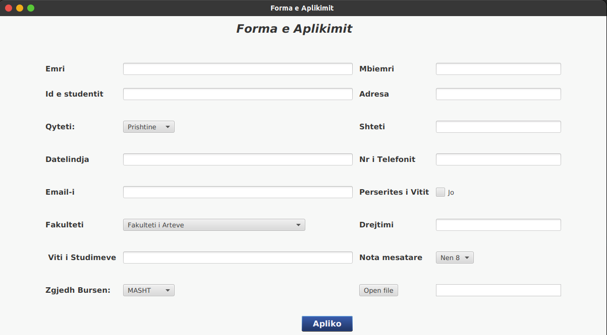

 <h1 style="color:rgb(0, 89, 179);font-family: Arial ;font-size:40px">Sistemi per menaxhimin e bursave te studenteve</h1> 

----
## Krijimi i nje `Graphical User Interface (GUI)` ne kuader te lendes Komunikimi-Njeri-Kompjuter
 

  

<figcaption align = "center"><b>Pamje nga GUI</b></figcaption>

---

## Table of Contents

- [Technologies](#Technologies)
- [Features](#Features)
- [License & CopyRight](#License-&-CopyRight)
---

 ## Features
 
 * Well Designed and Functional
 * Easy navigation
 * Animations 
 * Images and Illustrations
 * Consistency 
 ---

## Technologies 
 Project is created with:

---
 © Osman Bytyqi 2021
Licensed under the [MIT Licensed](https://github.com/OsmanBytyqi/Human-Computer-Intercation/blob/master/LICENSE)

